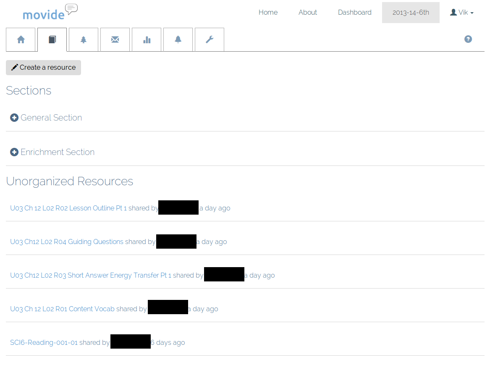
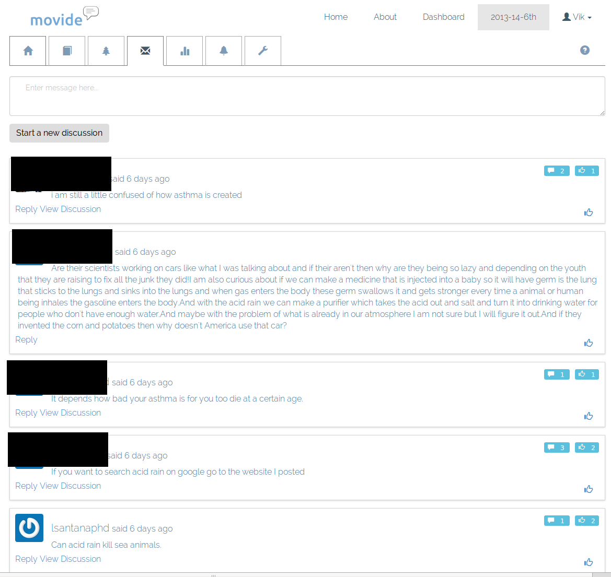

# Movide
## Vik Paruchuri
## Equirio

---
= data-x="0" data-y="0" data-scale="2"

## Who am I?

* Engineer at edX.
* Foreign Service Officer.
* Teach computers to predict things.
* Deeply interested in education.
* vik@equirio.com
* @VikParuchuri
* Grab this presentation at vikparuchuri.github.io/movide-pres

---
= data-x="1000" data-y="0" data-scale="1"

## Why Movide?

### The "old-style" LMS
* Not always mobile-friendly.
* Top-down style of teaching.
* Requires e-mail.
* Extremely powerful and rich.

### "Newer" style
* "Messy stream" of information.
* Data not under control of school.
* Not customizable.
* Very easy to use and student-friendly.

---
= data-x="2000" data-y="1000" data-scale="2"

## Movide

* www.movide.com
* Free and open source.
* Modern discussion interface.
* Enables students and teachers to both create content.
* Skill-based learning.

---
= data-x="3000" data-y="0" data-scale="2"

## Outline

---
= data-x="4000" data-y="2000" data-scale="1"

## Resources

---
= data-x="5000" data-y="0" data-scale="1"

## Skills

---
= data-x="6000" data-y="1000" data-scale="2"

## Discussion

---
= data-x="7000" data-y="2000" data-scale="2"

## Analytics

---
= data-x="8000" data-y="0" data-scale="1"

## State of Movide

* Currently gathering a lot of feedback.
* Under active development.
* Suggestions and contributions welcome.
* vik@equirio.com
* www.movide.com
